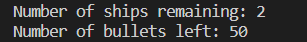

# Battleship Mayhem

Battleship Mayhem is a python terminal game, which runs in code institute mock terminal in heroku

The aim of this game isn't about being competetive or trying to beat the computer, it's a simple game made to refresh the mind before starting the day!

## How to play

Battleship mayhem is a game where you can visibly see the ships you need to destroy, you dont need to guess or be lucky to win, but can you do it in under 20 seconds? maybe 30? try to set a record for youself when playing, but remember, you have 50 tries until game is over and you lose.

## game rules
The "." sign is the empty water, if you hit it you gain nothing but lose a rocket.
The 0 is the ship on the sea, if you hit it you destroy a ship
If you miss though you will see the # sign which means you missed,
and x mean you hit the ship.

## Features
### Random board generator

- ships are randomly placed on the board

- You can see the ships you need to target using alphabets and numbers

- Track you score and how many ships remaining

- Track the rockets you have left

- you cannot fire the same spot twice

- you cannot type irrelevant letter or number otherwise it will reset

## Future features

- being able to play with the computer with a random ship generator
- increasing the amount of ships
- having a score board by the end of the game

## Testing

> I have manually tested this project by doing the following
- passed the code through a pep8 tester and confirmed no issues
- given invalid options which leads to resetting the game
- tested in my code terminal as well as Heroku terminal

## bugs 

- I had an issue in true_rocket_spot function where the rows and cols were 0 by default

- shoot_rocket funtion had a missing decrement which led to me having an infinite tries

## remaining bug 

- no remaining bugs

## Credits

- code institute for deployment terminal

- w3schools for some of the codes for functions and using global variables in that set